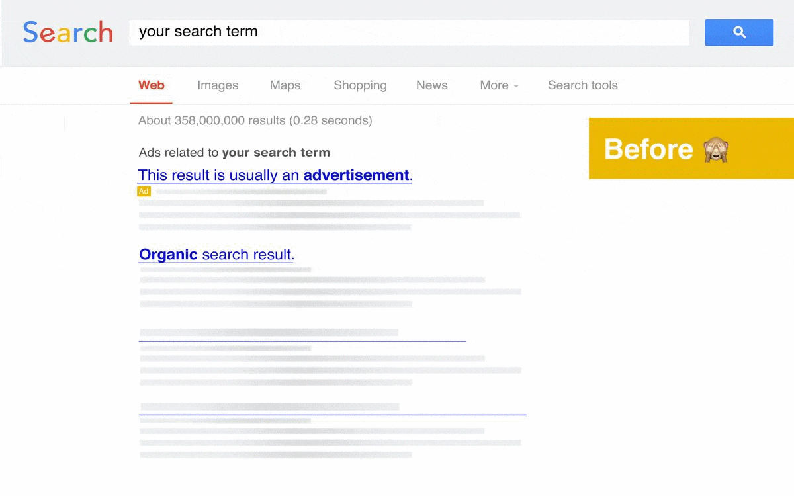

#  Ad Highlighter

#### Safari Extension for highlighting ads in search results

## What does it do?

It's taking search results ads highlighting few years back, where was a clean indication what was ad or not:

## Installation 

1. From AppStore

You can download it directly from mac AppStore: 

1. You can build it from source, but remember to allow unuathorized extensions.

You should follow tips given [here](https://osxdaily.com/2019/02/08/bypass-safari-no-longer-supports-unsafe-extension-error-mac/) to make it working

